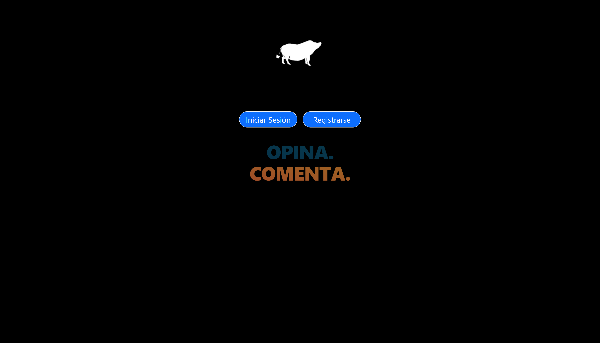
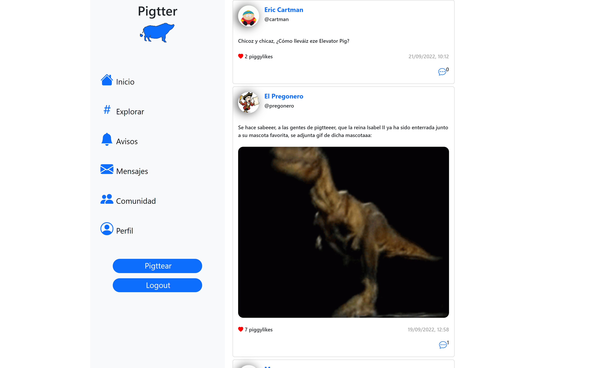

# Pigtter
<h4> Héroes y Heroínas - Hiberus </h4>

## Descripción 
 

 App imitación de twitter creada en grupo para el curso Héroes y Herínas de Hiberus y desarrollada en React. Tiene funcionalidades como registro y login. Puedes pigttear (twitear) y dar like a otro tweets. Además con react-router-dom puedes navegar a través de las páginas que contiene la app. En tu perfil puedes cambiar tu nombre de usuario y tu foto. La parte de backend ha sido desarrollada con Node.js y Express, y MongoDB como base de datos.

-React.js.
-Node.js
-Express.
-MogoDB.

 

## Url para ver el resultado
 
Aquí pueder ver el proyecto: https://pigtter.herokuapp.com/

 

## Desarrolladores
 

<a href =" https://github.com/JonathanSimonS" >
  
Jonathan

   
</a>

<a href ="https://github.com/sergeisg" >
  
Sergei

   
</a>

<a href ="https://github.com/antoni0ps" >
  
Antonio

   
</a>

<a href ="https://github.com/juanandres86" >
  
Juan Andrés

   
</a>

<a href ="https://github.com/grabbyel" >
  
Gabriel

   
</a>

# Getting Started with Create React App

This project was bootstrapped with [Create React App](https://github.com/facebook/create-react-app).

## Available Scripts

In the project directory, you can run:

### `npm start`

Runs the app in the development mode.\
Open [http://localhost:3000](http://localhost:3000) to view it in your browser.

The page will reload when you make changes.\
You may also see any lint errors in the console.

